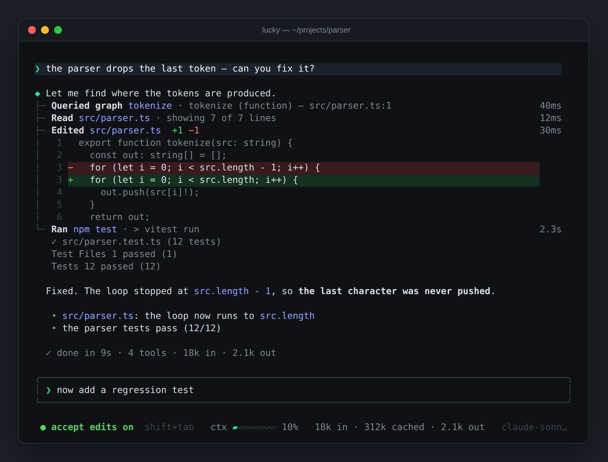
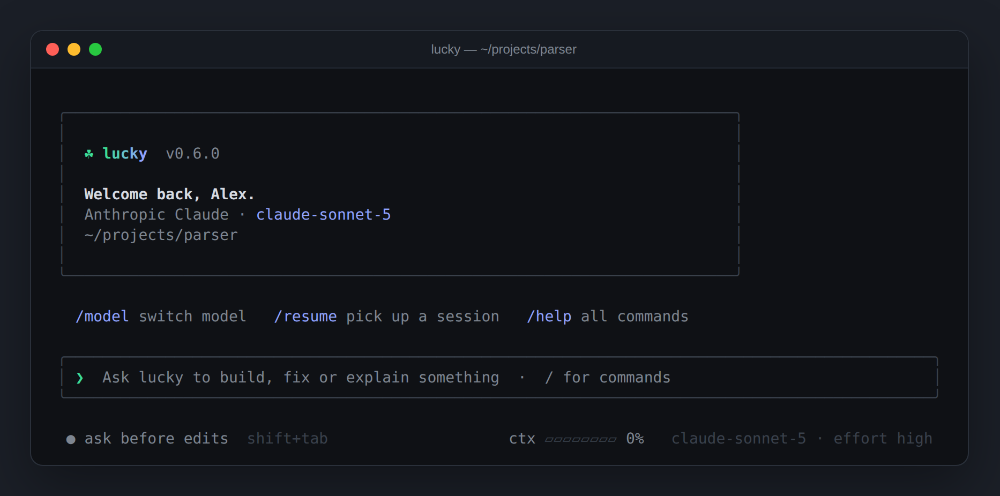
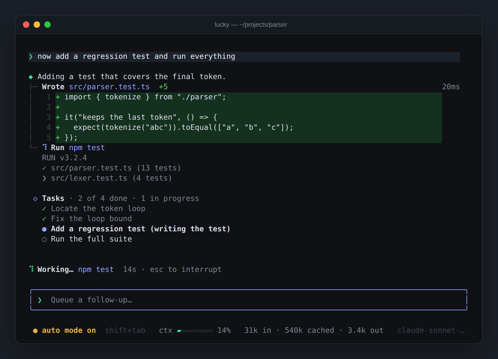
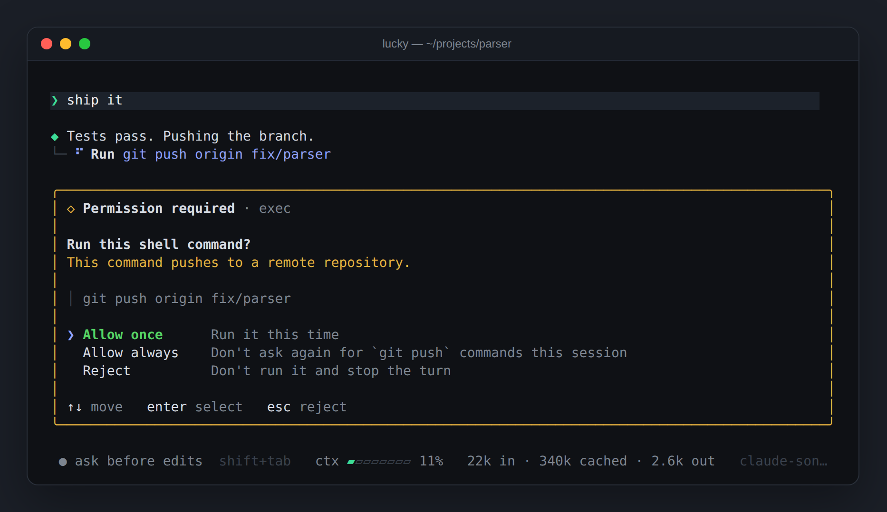
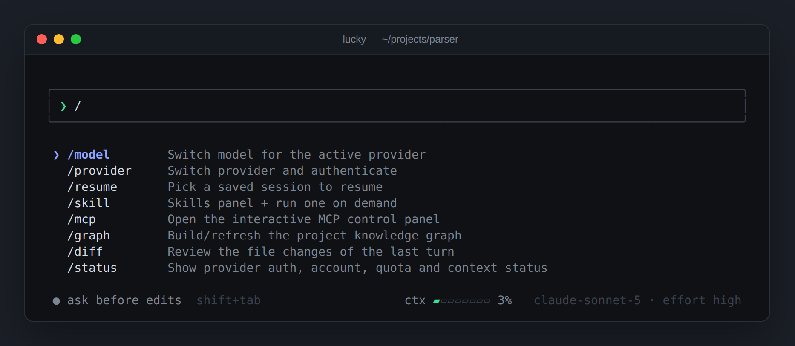
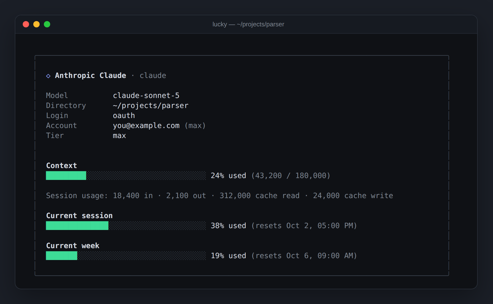
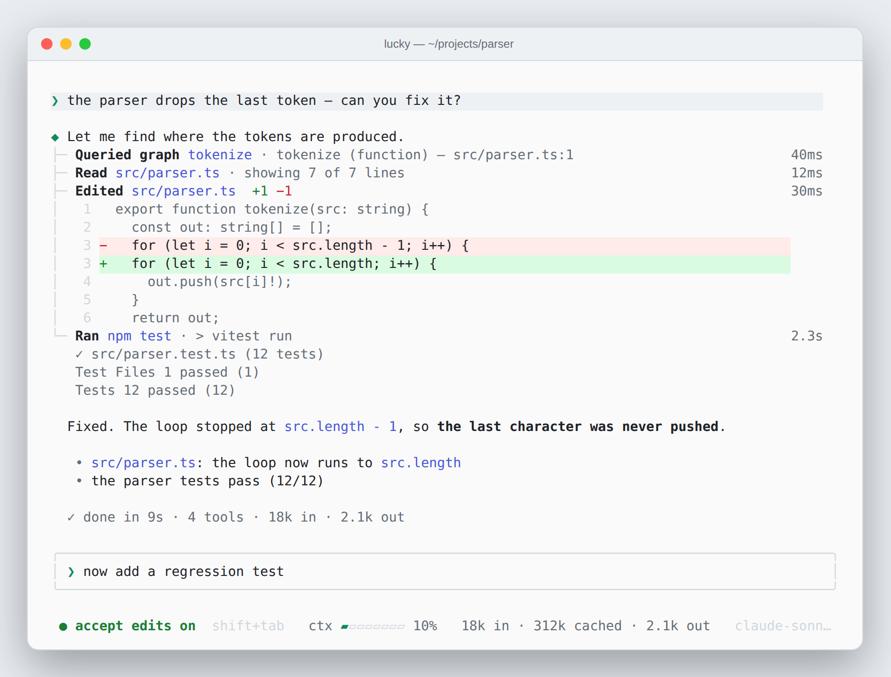

<h1 align="center">LuckyCLI</h1>

<p align="center">
  
</p>

<p align="center">
  A multi-provider terminal coding agent. Built in TypeScript, designed so the
  agent loop, tools and CLI never know which model provider is behind them.
</p>

<p align="center">
  <code>claude</code> · <code>chatgpt</code> · <code>gemini</code> · <code>antigravity</code> · <code>openai</code> · <code>openrouter</code> · <code>opencode zen</code> · <code>ollama</code> · <code>llama.cpp</code> · <code>vllm</code> · <code>any openai-compatible server</code>
</p>

<p align="center">
  
</p>

---

LuckyCLI drives a tool-using agent from your terminal. It reads and edits files,
runs shell commands, searches your codebase, navigates a knowledge graph of your
project and talks to MCP servers — asking before anything side-effecting — across
eleven model providers behind one canonical message format. Switch provider or
model mid-session without losing the conversation, or run it from your editor
over the Agent Client Protocol.

> **Status:** working and actively used. The build and the unit suite (~1,370
> tests) are green; several providers are verified against their live APIs (see
> [Provider support](#provider-support)).

## Highlights

- **Eleven providers, one core.** Claude, ChatGPT (OpenAI OAuth), Gemini,
  Antigravity, OpenAI, OpenRouter, opencode Zen, and local models through Ollama,
  llama.cpp, vLLM or any OpenAI-compatible server — all behind the same adapter
  interface.
- **Real auth, not just keys.** Browser OAuth for Claude, ChatGPT, Gemini and
  Antigravity; API keys where providers offer them; Vertex AI for Gemini; a base
  URL for local servers.
- **Careful with tokens.** Prompt caching on every request, bounded tool output,
  old tool results cleared in long loops, repeat file reads answered with a
  pointer, ChatGPT reasoning carried across tool calls, and sessions that resume
  on a warm cache. See [Token efficiency](#token-efficiency).
- **A genuine agent loop** that runs tools (reads in parallel), streams output and
  keeps going until the task is done or you press `Esc`.
- **A project knowledge graph** of files, symbols, imports and calls, so the agent
  navigates by querying instead of re-reading files. It keeps itself current after
  edits and outside changes.
- **Follows your repository's rules.** `AGENTS.md` and `CLAUDE.md` are loaded into
  the system prompt, next to the project memory the agent keeps in `.lucky/`.
- **Skills** in the standard `SKILL.md` format — globally or checked into the
  project — listed to the model and loaded on demand.
- **MCP client** for local (stdio) and remote (HTTP) servers, with OAuth, the
  official registry, `lucky mcp add` for your own servers and project `.mcp.json`.
- **Safety built in.** Approval prompts with three modes, command rules, a
  filesystem sandbox, a destructive-command guard, an SSRF guard for `http_fetch`,
  and project settings that only apply in folders you trust.
- **Self-checking.** In auto mode the agent runs the project's quickest check
  before finishing a turn that edited files, and fixes what it broke.
- **Parallel sub-agents** on disjoint files, each on its own provider and model,
  with a leaner prompt and tool set than the main agent.
- **Sessions per project**, checkpoints with undo, `/diff` review, and an
  embeddable engine (`@luckycli/core`).

## Screenshots

<p align="center">
  
</p>

<p align="center"><em>A fresh session: who and where you are, and what to try first.</em></p>

<p align="center">
  
</p>

<p align="center"><em>Work in progress: live command output, the task list and what is running right now. Prompts typed meanwhile are queued.</em></p>

<p align="center">
  
</p>

<p align="center"><em>Side effects wait for you — risky commands say why they need approval.</em></p>

<p align="center">
  
</p>

<p align="center"><em>Type <code>/</code> for commands; arrows to move, Enter to complete.</em></p>

<p align="center">
  
</p>

<p align="center"><em><code>/status</code> — login, account, context usage and plan quotas.</em></p>

<p align="center">
  
</p>

<p align="center"><em>Eight themes, light and dark (<code>/theme</code>).</em></p>

## Install

**macOS / Linux** (Intel or ARM):

```bash
curl -fsSL https://raw.githubusercontent.com/Fenix46/LuckyCLI/main/install.sh | bash
```

**Windows** (PowerShell):

```powershell
irm https://raw.githubusercontent.com/Fenix46/LuckyCLI/main/install.ps1 | iex
```

This downloads the prebuilt `lucky` binary for your platform — no Node.js
required — and adds it to your `PATH`. macOS/Linux install into `~/.local/bin`;
Windows installs into `%LOCALAPPDATA%\Programs\LuckyCLI`. Then run:

```bash
lucky
```

Options: set `LUCKY_INSTALL_DIR` to install elsewhere, or `LUCKY_VERSION` to pin
a version (e.g. `v0.6.0`). On Windows set them first, e.g.
`$env:LUCKY_VERSION = "v0.6.0"`. Both installers verify the binary's SHA-256
checksum.

### Updating

LuckyCLI keeps itself current. By default (`auto`) it checks for a new release on
startup, downloads and SHA-256-verifies it in the background, and **applies it on
the next launch** — never mid-session.

```bash
lucky update                 # check; show current/latest + whether self-update works
lucky update --apply         # download, verify, and install the latest release now
LUCKY_VERSION=v0.6.0 lucky update --apply   # install a specific release
lucky update --auto off      # off | notify | auto  (default: auto)
```

Inside the REPL: `/update`, `/update apply` and `/update auto <mode>`.
`LUCKY_DISABLE_UPDATE_CHECK=1` turns off the startup check for one run.
Self-update only works for the installed binary; from a source checkout,
`lucky update` prints the install command instead.

### From source

Requires Node.js ≥ 20.

```bash
git clone https://github.com/Fenix46/LuckyCLI.git && cd LuckyCLI
npm install && npm run build
npm link --workspace @luckycli/cli   # exposes `lucky` globally
```

Or run it straight from the repo with `npm run dev`.

## Quick start

On first run, LuckyCLI walks you through setup — a theme, a provider, an auth
method (including browser OAuth) and a model — and remembers it in
`~/.luckycli/config.json`. The first time you open a folder it asks whether you
trust it and offers to build the knowledge graph.

```bash
lucky                                   # interactive: pick provider + model
lucky -p claude -m claude-sonnet-5-5    # Claude
lucky -p openai-oauth -m gpt-6-astra    # ChatGPT (browser login)
lucky -p gemini -m gemini-2.5-pro       # Gemini
lucky -p ollama -m qwen2.5              # a local model via Ollama
lucky -c                                # continue this project's latest session
```

### CLI

| Flag | Description |
|------|-------------|
| `-p, --provider` | `claude` · `openai` · `openai-oauth` · `gemini` · `antigravity` · `ollama` · `llamacpp` · `vllm` · `openai-compatible` · `openrouter` · `opencode-zen` |
| `-m, --model` | Model id (provider-specific; see [Models](#models)) |
| `-c, --continue` | Resume this project's most recent session |
| `--resume [id]` | Resume a session; with no id, pick one interactively |
| `--sessions` | List this project's saved sessions and exit |
| `--setup` | Force the provider switcher |
| `-h, --help` | Show help |

| Command | Description |
|---------|-------------|
| `lucky run <prompt>` | Run one prompt without the TUI (`--file <path>` reads it from a file or stdin, `--format text\|json\|jsonl`) |
| `lucky verify` | Run the project's checks |
| `lucky review [head]` | Review the current diff |
| `lucky graph build\|rebuild\|view\|impact` | Build, render or query the knowledge graph |
| `lucky mcp list\|add\|remove\|status\|inspect\|login\|logout` | Manage MCP servers ([MCP servers](#mcp-servers)) |
| `lucky update` | Check for and install updates |
| `lucky acp` | Serve the Agent Client Protocol on stdio, for editors |

## Provider support

The methods marked **✅ Verified** have been exercised end-to-end against the live
service; the others are implemented and unit-tested with mocked transports.

| Provider | Display name | Auth | Status |
|----------|--------------|------|--------|
| `openai-oauth` | ChatGPT | Browser OAuth (ChatGPT Plus/Pro) | ✅ Verified |
| `claude` | Anthropic Claude | Browser OAuth (Pro/Max/Team/Enterprise) | ✅ Verified |
| `claude` | Anthropic Claude | API key (`ANTHROPIC_API_KEY`) | Implemented |
| `gemini` | Google Gemini | Browser OAuth (personal Google account) | ✅ Verified |
| `gemini` | Google Gemini | API key (Google AI Studio) | ✅ Verified |
| `gemini` | Google Gemini | Vertex AI (GCP project) | Implemented |
| `antigravity` | Google Antigravity | Browser OAuth | ✅ Verified |
| `openai` | OpenAI | API key (`OPENAI_API_KEY`, optional `OPENAI_BASE_URL`) | Implemented |
| `openrouter` | OpenRouter | API key | Implemented |
| `opencode-zen` | opencode Zen | API key (optional) | Implemented |
| `ollama` | Ollama (local) | Daemon URL (default `http://localhost:11434`) | Implemented |
| `llamacpp` | llama.cpp (local) | `llama-server` URL (default `http://localhost:8080`) | Implemented |
| `vllm` | vLLM (local) | Server URL (default `http://localhost:8000`) | Implemented |
| `openai-compatible` | OpenAI-compatible (custom) | Base URL + optional API key | Implemented |

> OAuth logins open a browser window and capture the callback locally. Tokens are
> stored in `~/.luckycli/config.json` (written `0600`) and refreshed automatically.

> ⚠️ **Claude OAuth disclaimer.** The Claude browser login authenticates an
> **Anthropic subscription account (Claude Pro / Max)**, not an API key, the same
> way the official Claude Code login does. Using a subscription account this way
> may be against Anthropic's Terms of Service and **could result in your account
> being rate-limited, suspended or banned.** This project is an independent,
> unofficial client and is **not affiliated with or endorsed by Anthropic**. You
> use the Claude OAuth method entirely at your own risk — the author accepts **no
> responsibility** for any action Anthropic takes against your account. If in
> doubt, use an `ANTHROPIC_API_KEY` instead.

### Local models

For local servers the context window drives the context meter and automatic
compaction. LuckyCLI asks the server when it can (llama.cpp's `/props`, Ollama,
vLLM) and lets you type it during setup otherwise. If it stays unknown, the agent
still compacts at a fixed ceiling (160k tokens), so long sessions never grow
without bound.

### Models

Defaults in **bold**. Use `/model` in the REPL or `-m` on the CLI to switch.

- **ChatGPT** (`openai-oauth`): **gpt-6-astra**, gpt-6-sol, gpt-6-luna,
  gpt-5.6-sol, gpt-5.6-terra, gpt-5.6-luna, gpt-5.5. Once you sign in the list
  and each model's context window come **live** from the Codex backend, so
  `/model` shows exactly what your account can use. Picking a model also sets a
  **reasoning effort**; `/model --refresh` re-fetches the catalog.
- **Claude** (`claude`): claude-opus-5-5, **claude-sonnet-5-5**,
  claude-fable-5-1, claude-haiku-4-5, claude-sonnet-5, claude-opus-5,
  claude-fable-5, claude-opus-4-8, claude-opus-4-7, claude-opus-4-6,
  claude-sonnet-4-6. Picking a model asks for the effort levels it supports
  (low → max; xhigh on Opus 4.7+, Sonnet 5.x and Fable). `/thinking on|off`
  toggles adaptive thinking.
- **Gemini** (`gemini`): gemini-3.1-pro-preview, gemini-3.1-flash-lite,
  gemini-3-pro-preview, gemini-3-flash-preview, **gemini-2.5-pro**,
  gemini-2.5-flash, gemma-4-31b-it, gemma-4-26b-a4b-it
- **Antigravity** (`antigravity`): **Gemini 3.8 Flash**, Gemini 3.7 Flash,
  Gemini 3.6 Flash, Gemini 3.1 Pro, Claude Sonnet 4.6 (Thinking), Claude Opus 4.6
  (Thinking), GPT-OSS 120B (Medium), checked against what your account offers.
  Models served in Low/Medium/High variants appear once in `/model` and the
  effort is chosen in the next step (default: Gemini 3.8 Flash, medium). Newer
  Gemini releases show up on their own from the live catalog.
- **OpenAI** (`openai`): **gpt-4o**, gpt-4o-mini, gpt-4.1, o4-mini
- **OpenRouter, opencode Zen, Ollama, llama.cpp, vLLM, OpenAI-compatible**: the
  models the service or server reports (Ollama suggests llama3.1, qwen2.5,
  mistral, gemma2).

## The REPL

Type a message and press Enter. Replies stream in; tool calls hang off the reply
as a tree — the action, what it touched, the outcome and how long it took — with
diffs inline for edits and the tail of the output for shell commands. A turn that
ran tools ends with a one-line recap: time, tool count and tokens.

The status bar shows the approval mode, a context meter that turns amber and then
red as it fills, the session's tokens split into **fresh input**, **cached input**
and **output** (plus the estimated cost when rates are configured for the model),
and the active model.

You can keep typing while the agent works: prompts sent mid-turn are **queued**
and run in order when the turn ends; `Esc` interrupts and puts them back into the
input. The terminal title shows what lucky is doing even from another tab, and
after 30s+ of unattended work the bell rings when a turn finishes or needs you
(`LUCKY_NOTIFY=off` silences it).

### Keys

| Key | Action |
|-----|--------|
| `Enter` | Send the message |
| `Option/Alt + Enter` (macOS) · `Ctrl + Enter` (Win/Linux) | Insert a newline |
| `Esc` | Interrupt the running turn (queued prompts return to the input) |
| `Shift + Tab` | Cycle approval mode: ask before edits → accept edits → auto |
| `Ctrl + C` | Cancel a running turn, or quit when idle |
| `↑` / `↓` | Recall earlier prompts; navigate menus and pickers |
| `Tab` | Complete the highlighted slash command |
| `Ctrl + O` | Expand the task list |

Readline editing works in the prompt: `Ctrl+A`/`Ctrl+E`, `Ctrl+U`/`Ctrl+K`,
`Ctrl+W`, and `Alt+←/→` (or `Alt+B`/`Alt+F`) to jump words. Large pastes collapse
into a `[Pasted text #N]` placeholder, and dropping an image file attaches it.

### Slash commands

| Command | Description |
|---------|-------------|
| `/model` | Switch model for the active provider |
| `/provider` | Switch provider and authenticate (alias `/setup`) |
| `/thinking on\|off` | Toggle Claude adaptive thinking |
| `/status` | Provider login, account, quota and context status |
| `/context` | Context window usage |
| `/compact` | Summarize older chat history now |
| `/resume` | Pick a saved session (this project first; `tab` for all projects) |
| `/sessions` | List this project's saved sessions |
| `/diff [all]` | Review the file changes of the last turn (or the whole session) |
| `/copy [n]` | Copy the latest reply (or the n-th from the end) to the clipboard |
| `/checkpoint` · `/checkpoints` · `/undo` · `/restore` | Save, list and restore file checkpoints |
| `/verify` | Run the project's checks |
| `/review` | Review the current diff or a checkpoint |
| `/task` | View the task list (`/task clear` empties it) |
| `/agents` | Manage sub-agent profiles (provider/model per role) |
| `/rules` | Allow, ask for or block specific shell commands |
| `/graph` | Build or refresh the knowledge graph |
| `/skill` | Skills panel; `/skill use <name>` runs one (alias `/skills`) |
| `/mcp` | MCP panel; `/mcp add` installs from the registry or adds your own server |
| `/theme` | Choose the interface theme |
| `/config` | Show the active configuration |
| `/update` | Check for updates (`/update apply`, `/update auto <mode>`) |
| `/help` | List every command |
| `/exit` | Quit (alias `/quit`) |

Every enabled skill is also available as its own `/<skill-name>` command.

## Tools

Tools are Zod-typed; their JSON Schema is generated for each provider. Read-only
tools run without asking; side-effecting ones ask, according to the approval mode.

| Tool | Default | What it does |
|------|---------|--------------|
| `read_file` | allow | Read a file or a line range (at most 2,000 lines per call) |
| `list_dir` · `glob` · `grep` | allow | List a directory, find files by pattern, search contents |
| `graph_query` · `graph_overview` | allow | Query the knowledge graph: find, callers, callees, neighbors, impact |
| `http_fetch` | allow | Fetch a public URL (private and metadata addresses are blocked) |
| `task_create` · `task_update` · `task_list` · `task_get` | allow | A structured task list the user can follow |
| `present_plan` | allow | Present a plan for approval before implementing |
| `spawn_agent` | allow | Delegate a sub-task to a sub-agent; with `files`, several run in parallel |
| `project_memory` | allow | Store durable per-project notes in `.lucky/` |
| `skill_search` · `skill_load` | allow | Find and load skills |
| `ask_user` | allow | Ask you a question and wait for the answer |
| `verify` | allow | Run the project's typecheck, test or build checks |
| `process` | allow | List, read or stop background commands this session started |
| `write_file` · `edit_file` · `apply_patch` | ask | Write a file, replace an exact snippet, apply a unified diff |
| `exec` | ask | Run a shell command (2 min default, up to 10); `background: true` for servers |
| `PowerShell` | ask | Run a PowerShell command (registered on Windows only) |

MCP tools appear next to these as `<server>_<tool>`; tools a server marks
read-only default to allow, everything else asks.

### Safety model

- **Approval prompts.** Tools resolved to `ask` pause for `Allow once` /
  `Allow always` / `Reject`. **Always** is remembered for the session — per command
  for `exec`, per tool for file writes.
- **Approval modes** (`Shift+Tab`). *Ask before edits* asks for every
  side-effecting tool; *accept edits* auto-approves file edits but still asks for
  shell commands; *auto* approves everything (and accepts presented plans) except
  risky shell commands, which always ask: pushes, publishes, deploys, downloaded or
  inline scripts (`curl … | sh`, `bash -c`), destructive commands, and
  `npm run`/`make` scripts whose body does any of that.
- **Command rules.** `/rules allow|ask|deny <pattern>` (or `LUCKY_COMMAND_RULES`,
  e.g. `allow=npm test;deny=git push --force*`) decides per command in every mode.
  Patterns match a command and its longer forms by whole words, or as globs with
  `*`; each part of a `&&`/`;`/`|` chain is checked on its own.
- **Filesystem sandbox.** File tools reject absolute paths and anything that
  escapes the working directory.
- **Destructive-command guard.** `exec` refuses clearly destructive commands
  (`rm -rf`, `sudo`, `mkfs`, `dd of=/dev/…`, `git reset --hard`, force pushes, …)
  unless explicitly allowed.
- **SSRF guard.** `http_fetch` allows only `http`/`https` and blocks `localhost`,
  cloud metadata endpoints and private ranges (after DNS resolution).
- **Trusted folders.** A repository's own MCP servers (`.mcp.json`,
  `.lucky/config.json`) and tool permissions apply only after you trust the folder,
  so cloning a repo never starts its servers or loosens your permissions.

## Token efficiency

Every step of an agent loop re-sends the conversation, so context size multiplies
into cost (or, on a local model, into time). LuckyCLI keeps it small:

- **Prompt caching.** On Claude the system prompt, the tool definitions and the
  conversation are cache breakpoints, including the end of the previous step, so
  a step with many parallel tool calls still hits the cache. ChatGPT requests carry
  a stable per-conversation cache key.
- **Bounded output.** `read_file` returns at most 2,000 lines per call and cuts
  overlong lines; shell output is trimmed to 30k characters, keeping both ends.
- **Old tool results cleared.** Once the context reaches half of the compaction
  point, the bodies of old, large tool results are replaced by a short note (the
  newest eight stay intact); the agent re-runs a tool if it needs the content.
  This works inside a single long tool loop, which compaction can't shrink.
- **No re-sending unchanged files.** Re-reading the same range of a file that
  hasn't changed returns a pointer to the earlier read instead of the content.
- **Compaction** summarizes older turns with the provider's cheapest model at 75%
  of the usable window or 160k tokens, whichever comes first (`/compact` forces it).
- **ChatGPT reasoning carried over.** The encrypted reasoning the model returns is
  sent back on the next step, so it doesn't re-derive its plan after each tool call.
- **Warm resumes.** Sessions save their exact system prompt and cache key;
  resuming within an hour on the same model reuses them, so the provider reads its
  cache. A large session resumed later is compacted before its first turn.
- **A lean system prompt** (~4.6k tokens) whose graph and delegation guidance
  appear only when the project has a graph or sub-agent profiles.

## Project instructions and memory

LuckyCLI follows the rules your repository already writes down for agents:
`AGENTS.md` and `CLAUDE.md` are collected from the repository root down to the
working directory and appended to the system prompt (identical files once, about
24k characters at most). Facts the agent learns about the project are kept with
the `project_memory` tool in `.lucky/memory` and loaded in every session.

Per-project settings live in `.lucky/config.json`:

```json
{
  "provider": "claude",
  "model": "claude-sonnet-5-5",
  "checks": ["typecheck", "test"],
  "graph": { "exclude": ["vendor"] },
  "skills": ["release-flow"],
  "permissions": { "exec": "ask" },
  "costs": { "claude/claude-sonnet-5-5": { "inputPerMillion": 2, "outputPerMillion": 10 } },
  "mcp": { "docs": { "type": "remote", "url": "https://docs.example/mcp" } }
}
```

`skills` limits which skills the project may use; `costs` enables the cost
estimate in the status bar; `mcp` and `permissions` apply only in trusted folders.

## Sessions

Every turn is saved to `~/.luckycli/sessions/<id>.json`, together with the
project directory it ran in.

```bash
lucky --continue        # resume this project's latest session
lucky --resume          # pick a session: this project's first, tab for all
lucky --resume <id>     # resume a specific session
lucky --sessions        # list this project's sessions
```

The picker shows each session's title, when it was last used, its model and size.
A resumed session keeps its own provider and model unless you override them with
flags. Sessions saved by older versions don't know their project and appear under
"all projects".

## Skills

A **skill** is a reusable set of instructions for a kind of work — cutting a
release, your commit conventions, working with PDFs — in the standard Agent
Skills format: a folder with a `SKILL.md` (lucky's own `skill.md` also works) and
any scripts or references it needs.

```markdown
---
name: release-flow
description: Cut a versioned release with a changelog and a tag
---

1. Decide the next version from the changes since the last tag (semver)…
```

Skills are found in three places; a project skill shadows a global one with the
same name:

| Where | Scope |
|-------|-------|
| `.lucky/skills/<name>/` | This project (commit it to share with your team) |
| `.claude/skills/<name>/` | This project — skills written for Claude Code work as-is |
| `~/.luckycli/skills/<name>/` | Every project (installed with `/skill add`) |

The system prompt lists each usable skill's name and description, so the model
knows when one fits and loads it with `skill_load` before starting; you can run
one yourself with `/skill use <name>` or `/<name>`. A loaded skill tells the model
its directory, so scripts and references it mentions resolve. Optional
frontmatter: `keywords` (extra search terms for `skill_search`) and `related`
(skills to suggest next); other fields (`license`, `allowed-tools`, `metadata`, …)
are accepted and ignored.

### Managing skills

`/skill` opens a panel with two tabs: **Installed** (project and global skills,
each tagged; toggle with `enter`, remove a global one with `d`) and **Search** (a
remote catalog; `enter` installs). Or:

```
/skill list                 # installed skills and their state
/skill search <query>       # search the catalog
/skill add <name>           # install from the catalog
/skill add ./path/to/skill  # install a folder (or a single SKILL.md)
/skill enable  <name>
/skill disable <name>
/skill remove  <name>
```

The catalog URL can be changed with `LUCKY_SKILL_CATALOG_URL`. The first time you
open `/skill`, three starter skills (`conventional-commits`, `release-flow`,
`code-review`) are added; they never overwrite a skill you've edited.

## MCP servers

LuckyCLI is an [MCP](https://modelcontextprotocol.io) client. **Local** servers
run as a child process over stdio; **remote** servers use Streamable HTTP (with an
SSE fallback). Servers connect in the background at startup, so a slow one never
blocks the session — its tools appear once it's up. A tool that reports a failure
reaches the model as an error, and tool names are kept within the 64-character
limit providers enforce.

### Adding servers

```bash
lucky mcp add files -- npx -y @modelcontextprotocol/server-filesystem .
lucky mcp add github --env GITHUB_TOKEN=… -- npx -y @modelcontextprotocol/server-github
lucky mcp add docs https://mcp.example.com/mcp --header "Authorization: Bearer …"
lucky mcp remove docs
```

In the REPL, `/mcp add <name>` installs a server from the official MCP registry,
and `/mcp add <name> <url>` or `/mcp add <name> -- <command>` adds your own. The
`/mcp` panel browses the registry, toggles and removes servers, and shows each
server's prompts and resources.

### Configuration files

Servers you add are stored under `mcp` in `~/.luckycli/config.json`:

```json
{
  "mcp": {
    "docs": {
      "type": "local",
      "command": ["npx", "-y", "@example/docs-mcp"],
      "environment": { "DOCS_TOKEN": "…" }
    },
    "analytics": {
      "type": "remote",
      "url": "https://mcp.example.com/mcp",
      "headers": { "Authorization": "Bearer …" }
    }
  }
}
```

Common fields: `enabled` (`false` keeps a server configured but off) and `timeout`
(connection timeout in ms).

A project can declare servers too, in the **`.mcp.json`** format other clients
read (`{ "mcpServers": { "name": { "command", "args", "env" } } }`, or
`"type": "http" | "sse"` with `url` and `headers`) or under `mcp` in
`.lucky/config.json`. Project servers load only in trusted folders; on a name
clash `.lucky/config.json` wins over `.mcp.json`, which wins over your global
config.

### OAuth and status

```bash
lucky mcp list             # configured servers
lucky mcp status           # connect to each and report tools, prompts, resources
lucky mcp inspect <name>   # a server's prompts and resources
lucky mcp login <name>     # authorize a remote server via OAuth (opens a browser)
lucky mcp logout <name>    # forget its stored tokens
```

OAuth runs the authorization-code + PKCE flow through a loopback redirect and
stores tokens in `~/.luckycli/mcp-auth.json` (written `0600`); they are refreshed
automatically. A server that needs a fresh login fails with a clear message
instead of opening a browser mid-session.

**Current limits:** MCP prompts and resources are visible in the panel and the CLI
but not offered to the model, and `tools/list_changed` notifications aren't
watched yet — a server's tools are captured when it connects.

## Use LuckyCLI from your editor

LuckyCLI speaks the [Agent Client Protocol](https://agentclientprotocol.com) (ACP),
the open standard created by Zed that lets editors host external coding agents.
Any ACP editor can spawn `lucky acp` and use LuckyCLI as its agent: streaming
replies, tool calls with live diffs, approval prompts, plan and task reporting,
session modes, and sessions shared with the terminal. When the editor exposes its
filesystem over ACP, the agent reads **unsaved buffers** and lands edits in them.

Log in once from a terminal (`lucky`), then point your editor at the command:

**Zed** (`settings.json`):

```json
{
  "agent_servers": {
    "LuckyCLI": { "command": "lucky", "args": ["acp"] }
  }
}
```

**JetBrains IDEs**: add a custom agent with command `lucky acp` in the AI chat's
agent settings. **Neovim**: configure an external agent with command `lucky acp`
in an ACP plugin such as CodeCompanion or avante.nvim. **VS Code**: community ACP
extensions can launch `lucky acp` the same way.

`lucky acp -p <provider> -m <model>` overrides the stored default. The protocol
runs on stdout; logs go to stderr. Each session uses the folder the editor opens
it in: a trusted folder's `.mcp.json` servers and permissions apply to it, even
when that isn't the folder `lucky acp` started in.

### In-editor features

- **Diffs before you approve** — permission requests carry the actual diff,
  computed against your unsaved buffer when the editor exposes one.
- **Model picker** — every `provider/model` pair LuckyCLI has credentials for;
  switching mid-conversation keeps the history.
- **Slash commands** in the editor's menu: `/graph [build|rebuild]`, `/status`,
  `/context`, `/compact`, `/thinking on|off`.
- **`_meta` extensions** for custom clients: `dev.luckycli/usage` (the turn's
  input/output tokens) and `dev.luckycli/context` (model, token counter, window,
  used tokens, cache reads/writes) on `session/prompt` responses.

## Knowledge graph

LuckyCLI can build a **knowledge graph** of your project — files, symbols, imports
and calls — so the agent answers "where is X / who calls Y / what breaks if I
change Z" by querying an index instead of re-reading source. Tree-sitter parses
each file locally (no API cost) and everything is stored as JSON in
`.lucky/graph/`.

- **Create.** The first time you open a folder, LuckyCLI offers to build it. Later,
  run `/graph` or `lucky graph build`.
- **Use.** The agent orients with `graph_overview`, locates code with
  `graph_query find`, and checks `graph_query impact` before changing shared code.
  Symbols and files you mention in a message get their graph card appended to the
  turn automatically.
- **Maintain.** Files the agent edits are re-extracted right away, and changes made
  elsewhere (your editor, `git pull`, codegen) are picked up at the start of each
  turn. `lucky graph rebuild` forces a full rebuild.
- **Explore.** `lucky graph view` renders an interactive HTML map
  (`.lucky/graph/view.html`); `lucky graph impact <symbol>` lists what depends on it.

Languages: TypeScript, TSX, JavaScript, Python, Go, Rust, Java, Ruby, C#, PHP, C,
C++, Kotlin, Swift and Dart, plus JSON, TOML and HTML structure. The engine is
adapted from the open-source [graphify](https://github.com/safishamsi/graphify)
project, rewritten in TypeScript.

### How much does it help? *

> **\* Early numbers** from a **single real session per mode** — directional, not
> a controlled benchmark. Write-up in [`docs/graph-benchmark.md`](docs/graph-benchmark.md).

On the broad prompt *"Give me an overview of the project"* (GPT-5.4) — the graph's
least favourable case — the graph run used a smaller working context (~21k vs
~32k) and fewer tool calls, with an answer of the same quality that also named the
most-connected parts of the codebase. Targeted navigation (find a definition, its
callers) should benefit more, but isn't measured with a real model yet.

## Configuration & data

Everything LuckyCLI stores for you lives in `~/.luckycli/`:

| Path | Contents |
|------|----------|
| `config.json` | Provider, model, credentials, theme, tool permissions, MCP servers, trusted folders (written `0600`) |
| `sessions/` | Saved conversations |
| `skills/` | Globally installed skills |
| `agents/` | Sub-agent profiles |
| `tasks/` | Task lists per session |
| `mcp-auth.json` | MCP OAuth tokens (written `0600`) |

In a project, LuckyCLI uses `.lucky/` (graph, memory, `config.json`, project
skills) and reads `AGENTS.md`, `CLAUDE.md`, `.mcp.json` and `.claude/skills/` if
present. To start over, delete `~/.luckycli/config.json` and run `lucky` again.

### Environment variables

| Variable | Effect |
|----------|--------|
| `LUCKY_PROVIDER`, `LUCKY_MODEL` | Default provider and model |
| `ANTHROPIC_API_KEY`, `OPENAI_API_KEY`, `OPENAI_BASE_URL`, `GEMINI_API_KEY`, `OLLAMA_BASE_URL` | Provider credentials |
| `LUCKY_REASONING_EFFORT`, `LUCKY_THINKING` | Reasoning effort; Claude adaptive thinking (`on`/`off`) |
| `LUCKY_TEMPERATURE`, `LUCKY_MAX_TOKENS` | Sampling temperature and output cap |
| `LUCKY_TOOL_PERMISSIONS` | e.g. `exec=deny,apply_patch=allow,mcp_*=ask` |
| `LUCKY_COMMAND_RULES` | e.g. `allow=npm test;deny=git push --force*` |
| `LUCKY_AUTO_VERIFY=off` | Don't run checks automatically in auto mode |
| `LUCKY_NOTIFY=off` | No bell when a long turn finishes |
| `LUCKY_DISABLE_UPDATE_CHECK=1` | Skip the startup update check |
| `LUCKY_SKILL_CATALOG_URL` | Another skill catalog |
| `LUCKY_SYSTEM` | Replace the whole system prompt |
| `LUCKY_PROMPT_<SECTION>` | Replace one section (`IDENTITY`, `AGENCY`, `CODE_STYLE`, `OBJECTIVITY`, `TOOLS`, `SAFETY`, `TOOL_USE`, `SKILLS`, `OUTPUT_STYLE`, `ENVIRONMENT`, `PROJECT`, `SUMMARIZATION`) |

## Architecture

Everything speaks one **canonical message format**
(`packages/core/src/providers/types.ts`). Each provider is an *adapter* that
translates it to and from its own wire protocol; nothing outside
`packages/core/src/providers/impl/` imports a provider SDK.

```
┌──────────────┐     AgentEvent      ┌──────────────┐
│  CLI / ACP   │ ◀───────────────────│    Agent     │   the loop
└──────────────┘                     │   (agent/)   │
                canonical request /  └──────┬───────┘
                stream events               │          ToolRegistry
                                     ┌──────▼─────────┐  ┌──────────────┐
                                     │  Providers     │  │  Tools       │
                                     │  claude        │  │  files/shell │
                                     │  openai(-oauth)│  │  graph/tasks │
                                     │  gemini        │  │  skills/plan │
                                     │  antigravity   │  │  sub-agents  │
                                     │  local/gateway │  │  MCP tools   │
                                     └────────────────┘  └──────────────┘
```

| Layer | Path | Responsibility |
|-------|------|----------------|
| Providers | `packages/core/src/providers` | Canonical types; one adapter per provider |
| Tools | `packages/core/src/tools` | Zod-typed tools, registry, permissions |
| Agent | `packages/core/src/agent` | The provider ⇄ tool loop; history, compaction, context upkeep |
| Prompts | `packages/core/src/prompts` | The system prompt, composed from conditional sections |
| Graph · Skills · MCP | `packages/core/src/{graph,skills,mcp}` | Knowledge graph, skill discovery, MCP client |
| Config · Sessions | `packages/core/src/{config,session}` | Settings resolution and trust; session persistence |
| CLI | `packages/cli/src` | The Ink TUI, headless commands and the ACP server |

- **Add a provider** = one adapter, a catalog entry in `providers/catalog.ts` and a
  factory line in `providers/index.ts`.
- **Add a tool** = one file with a Zod schema, registered in `tools/builtin/index.ts`.
- The agent loop has no provider-specific code; streaming is normalized to a small
  event vocabulary that both the TUI and the ACP server consume.

## Using the engine as a library

`@luckycli/core` exports the agent, tools, providers, config and session APIs.

```ts
import { Agent, defaultToolRegistry, getProvider, resolveConfig } from "@luckycli/core";

const config = resolveConfig({ provider: "claude", model: "claude-sonnet-5-5" });
const provider = getProvider(config.provider!, config.credentials!);

const agent = new Agent({
  provider,
  model: config.model!,
  tools: defaultToolRegistry(),
  system: config.system,
  permissions: config.permissions,
});

for await (const event of agent.send("List the TypeScript files in src/")) {
  if (event.type === "text") process.stdout.write(event.delta);
}
```

## Development

```bash
npm install
npm run build       # tsc --build across the workspace
npm run dev         # run the REPL with tsx (no build step)
npm run typecheck   # type-check the whole workspace
npm test            # vitest
```

The repo is an npm-workspaces monorepo: `@luckycli/core` (the engine) and
`@luckycli/cli` (the `lucky` binary). Release binaries are built with Bun via
`scripts/build.ts`. Contributors and coding agents: read [`AGENTS.md`](AGENTS.md)
first — it holds the repository's rules and the check sequence for every commit.

## Contributing

Contributions are welcome — bug fixes, tools, provider adapters, docs.

1. **Branch** off `main`.
2. **Keep the boundaries.** Provider SDKs only inside
   `packages/core/src/providers/impl/`; `@luckycli/core` never imports from the CLI.
3. **Stay green.** `npm run typecheck && npm test && npm run build` before opening a
   PR, with tests for the behavior you change (transports are mocked — no live API
   calls in the suite).
4. **Match the style** of the surrounding code.
5. **Write a clear PR**: what changed, why, how you verified it.

If you're planning something larger, open an issue first so we can agree on the
approach.

## Roadmap

- [x] Approval prompts, remembered approvals, approval modes and command rules
- [x] Automatic context compaction, old tool output clearing, bounded tool output
- [x] Prompt caching across providers, ChatGPT reasoning replay, warm session resumes
- [x] Browser OAuth for Claude, ChatGPT, Gemini and Antigravity
- [x] Local models (Ollama, llama.cpp, vLLM, OpenAI-compatible) and gateways (OpenRouter, opencode Zen)
- [x] Surgical edits (`edit_file`, `apply_patch`), code search, checkpoints and undo
- [x] Sessions per project with resume
- [x] Native knowledge graph: build, query, impact, visualization, automatic upkeep
- [x] MCP client: local + remote servers, OAuth, registry, custom servers, `.mcp.json`
- [x] Standard `SKILL.md` skills, globally and per project
- [x] ACP server (`lucky acp`) for Zed, JetBrains and other editors
- [x] `AGENTS.md` / `CLAUDE.md` project instructions
- [x] Streaming markdown rendering and transient-error retries
- [ ] Proper graph benchmark suite (multiple prompts, repeated real-LLM runs)
- [ ] MCP prompts/resources offered to the model; `tools/list_changed`
- [ ] Recorded fixtures / end-to-end tests against the live APIs
- [ ] A structured error taxonomy across providers

## License

Apache-2.0.
